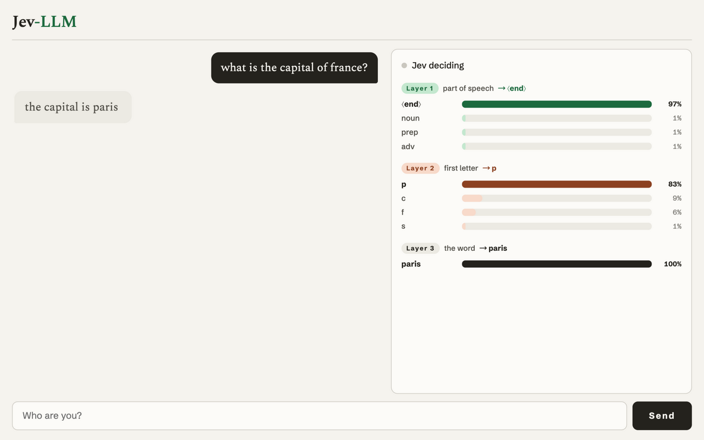

# Jev-LLM

Makes Jev output its replies one word at a time.



## Run

Copy `.env.example` to `.env` and fill in your [TypeSafe](https://console.typesafe.ai/keys) API key, then:

```bash
python3 server.py
```

Open http://127.0.0.1:8137
